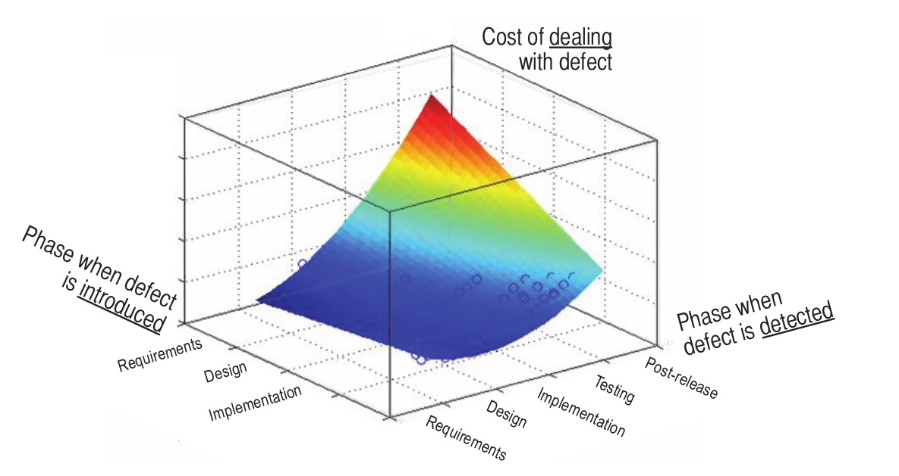
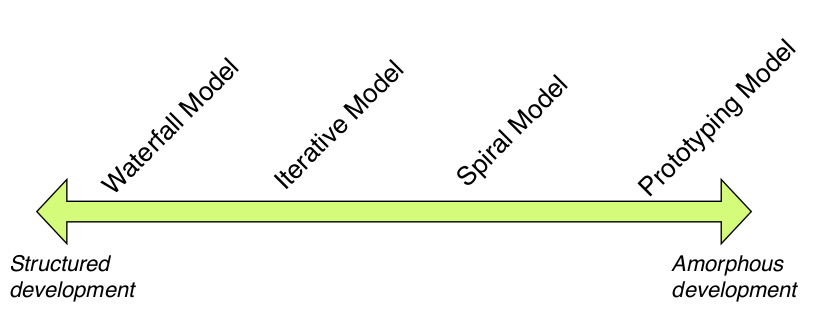
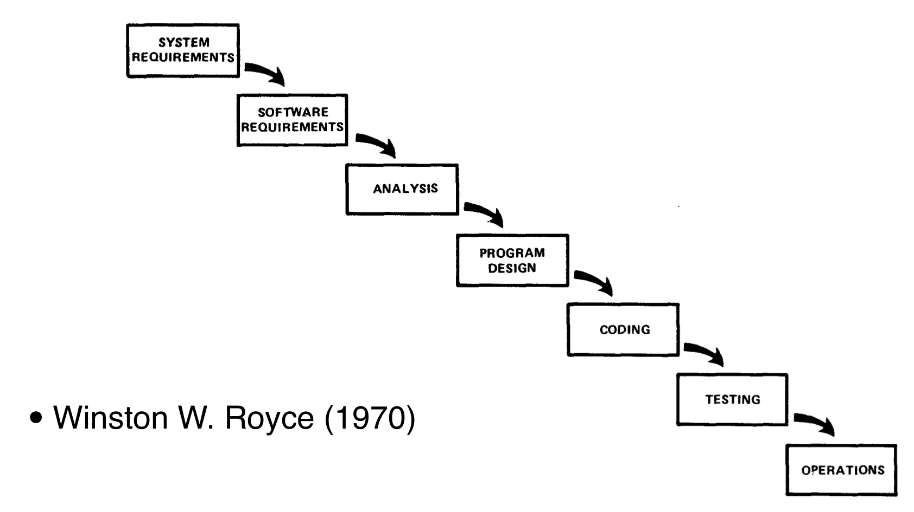
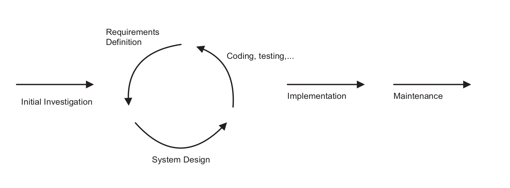
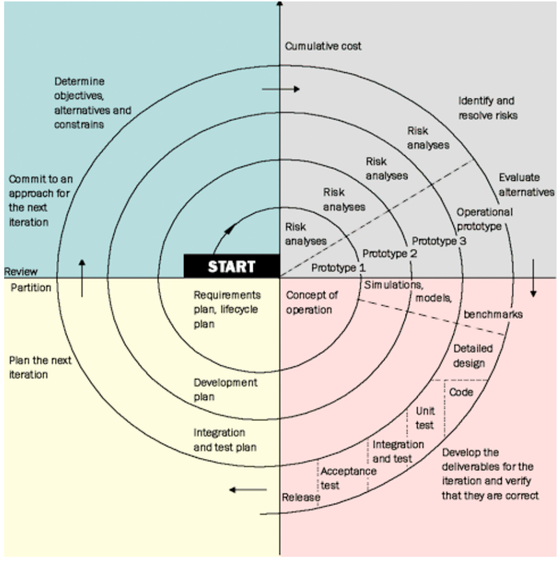
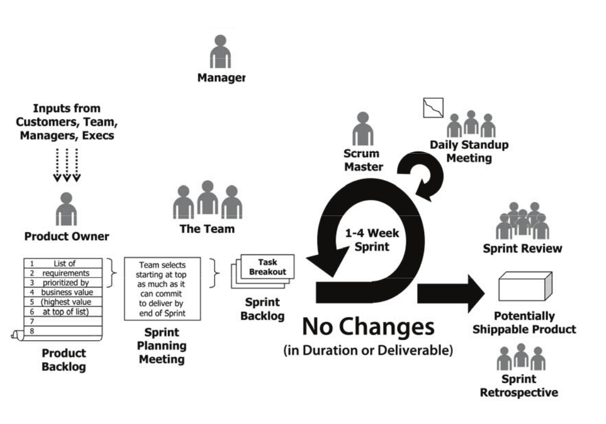
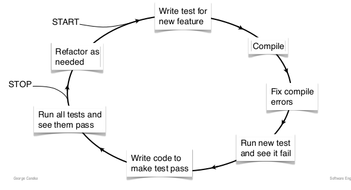

# 1 - Introduction

## Complexity = the #1 challenge

### Software verification

 - Testing
 - Human proofs
  - Mathematical view
  - Write code and prove it correct
 - Machine proofs
  - Same thing as human but by machine
  - automatically prove correctness

Complexity grows exponentially in number of branches. It is therefore impossible to rely only on testing and proofs: we need guidelines, principles...

## Preventing and finding errors early

The cost of errors varies according to when they are detected and introduced:

# 2 - Agile Development

## The Management Challenge
Managers are required to coordinate members of the team. Their task is difficult as software engineering is still a young field.
Large project suffer of this young age: they are on average 1 year late and 100% over budget.

Project success rate seems inversely proportional to the budget.

## Managing your software project

### Tests!
Should be written before or during code writing. They are part of the software.

## Development models: The waterfall method

It is a linear model, where each step is completed before the next starts. Documentation and review happen at *each phase transition*.

Specifications serve as "contracts". Dates are frozen

The model is often used in government projects or by big software houses.

Early validation enforces stability of requirements and saves a lot.

**Structure and discipline**: the process is control and therefore good for inexperienced or new staff and is resilient to departing staff.

However many **problems appear only by doing**. The process is slow and inflexible. No previews for the customer.

### When to use?
When the project definition is clear and the technologies mature and with no surprises or when the project has already been done.

Also good for inexperienced teams or managers.

It is still largely used by large and complex projects (enterprise).

## Development models: The Prototyping model

Purely iterative, iterate the loop until finished. Sometimes called *evolutionary model*.

### Strengths

 - Flexible, also for user that have to define needs
 - User (customer) participation -> satisfaction
 - Can survive unclear objectives
 - Gets faster at each iteration, if team learns from it
 - Innovation is encouraged
 - A functional application, soon

### Weaknesses

 - Hard to manage
 - Can lead to poor design, not always evolution: prototypes are often *throwaway* and may become final product.
 - The incomplete analysis of the problem may lead to only address superficial issues and could iterate forever

### When to Use

 - Short-lived demos and UIs
 - unclear user requirements
 - inexperienced customer
 - Need for immediate implementation
 - Stable and experienced team

## Development models: The Incremental (or iterative) Model

Basically Waterfall with divide-and-conquer strategy: project is broken down into smaller parts each of which treated with the iterative approach.
This reduces the risks introduced by both models.

Three possibilities:

 - Sequence of mini-waterfalls where each release adds more functionality
 - Mini waterfalls broken down to be pursued in parallel (ATTENTION TO INTERFACES)
 - Waterfall up to (and including design), then do iterative prototyping

### Strengths

 - learn from previous iterations
 - better control
 - Customer gets functionality early
 - Integration risks are taken care of through increments
 - Sooner into production
 - Can accomodate changing requirements

### Weaknesses

 - Mini-waterfalls do not encourage thinking ahead
 - *Good interfaces* between components must be defined early
 - Not all requirements upfront, incompatiblities later.

## Development models: The Spiral Model

*Reduce risk in every phase*

### Strengths

 - High risks found early
 - Fast prototyping thanks to user involvement at every step
 - Design can evolve
 - Alternatives are explicitly considered
 - Maintenance in spiral by default.
 - Can integrate other models.

### Weaknesses

 - A lot of time spent on risks and objectives evaluation
 - complex
 - no firm deadlines, risk of infinite spiral
 - Developers must be reassigned during non dev
 - If sw by contract, user should know risks before, not during development.

### When to use

 - Medium/High risk projects
 - Medium/large size systems
 - Can tolerate resource consumption
 - Robust implementations more important than functionality
 - Significant changes expected

## Developers models: Agile Development
builds upon iterative development.

Principles: frequent feedback (instead of planning), communication, prototypes to understand customer requirements.

Methods: scrum, adaptive, feature driven, crystal clear, extreme programming, rapid application, rational unify

### Scrum

mid 80s, formalized in 1995.

 - **Product owner** represents customer's or end user's interests. He wants to maximize business value. Translates needs into priority risks.
 - the **Team** builds the product. Devs, UIs, testers are mixed in it. It is *self managing, autonomous and accountable*. 5-10 people. For large projects, use several teams.
 - **Scrum master**: ensures the team's success. **NOT A MANAGER**. Protects the team (manager, product owner). Could be a member of the team
 - **Manager** not a nanny, but guru. He mentors, coaches, helps in problem-solving.
 - **Product backlog** created by product owner, it articulates the product vision. It is a to-do list *prioritized by value to customer*. It may contain features, development requirements and/or research/investigative tasks or even bugs to solve. *evolves over time*. The team provides time estimates which are used to prioritize backlog
 - **Sprint planning meeting**: first step of every sprint. Product owner and team review together the Product backlog. New items are picked from the top of the list to be completed in the sprint, split into tasks thus producting the sprint backlog.
 - **Daily scrum**: stand-up, lasts less than 15 minutes. Each team member reports [what done since last meeting, what will be done until next meeting, blocks/impediments]. **no discussion, just reporting**. Master resolves impediments and updates progress sheet.
 - **Sprint review**: demo (<30 min), everyone present (team, master, product owner, customers, stakeholders, experts...). Anyone can ask questions and lasts as long as necessary.
 - **Sprint retrospective**: team + master + owner. Neutral outsider facilitates conflicts. Product owner updates backlog.

Sprint should have the same duration. If goals are not met, the team must own up to it.

# 3 - Modularity and Abstraction

## Code Layout

Visual Layout matters: it shows the logical structure of the program, allows knowledge compilation and withstand the test of time.

### Class

 1. Header comment
 2. class attributes
 3. public methods
 4. protected methods
 5. private methods

One class / interface per file. Class name => file name.

Upper camel case for names.

Within a file, separate methods clearly

Keep lines short (<= 120 chars max, aim for 80).
Classes length <= 2000 lines.

Group imports by package and avoid wildcard imports.

### Method
Align parameter type, not name if many parameters. Keep methods small and focused (max 150 lines, if > 50 ask if shouldn't restructure), max 7 parameters. Simple control flow, avoid mutual recursion.

### Statements

 - Use braces even for single statement blocks, each statement on a line by iteself.
 - Indentation!
 - separate blocks with whitelines
 - Split complex predicates cleanly (e.g. on multiple lines), operator at the end of split line
 - one line = one action. (e.g. one counter per for loop).

### Variable names

 - 10-16 chars
 - CLEAR
 - Longer names for rarely used variables.
 - Indexes: *i,j* except when used outside loop.
 - use computed values names (*total, sum, average, max, min*) appending them to variable name. (except *num* which goes at beginning of word, avoid if possible)
 - Use common opposites
 - explicit names & one variable for one purpose.
 - Avoid generic names like *flag* and use specific name.
 - Don't use/forget about strange behaviors: `bytesRead` number of bytes received, negative in case of error
 - Separate namespaces: `namespace` in C++, java packages (`Database::Table`)
 - Use **enumerations**
 - Booleans: name should reflect that is a boolean (`status`: bad, `success`: good). Use *positive* booleans names. (Not everyone is as smart as you with logic)
 - Should pass telephone test!
 - Abbreviate: remove *-ing, -ed*, articles... Use a "Shortening Abbreviation" document.
 - Data variables: put in comments what canno tgo in name.
 - Names shoud differ in at least two characters.
 - Avoid numerals (`fiel1, file2`) and commonly mispelled words.
 - Use a single natural language for project (US / UK eng, french...)

 TO BE FINISHED

# 4 - Validation and Testing

## Defensive programming

### Deal with invalid inputs:
Check for input validity:

 - null references
 - parameters in valid range
 - Stream status, access type

**invalid input => throw exception**
Do not abuse exceptions (e.g. for flow control).
If the validity check is too expensive/impractical and done implicitly (call other function checking its arguments) it is allowed not to do it. However it is advised to wrap/translate the exception. Add meaningful information to the exception, try to put yourself in the shoes of the catcher.

Exceptions should be caught at the right level.

### Exceptions

 - **checked** (try catch): recoverable conditions
 - **unchecked** (`RuntimeException`) Stop the program, cannot recover.

### Using invalid data
Always consider the key trade-off: is throwing exceptions more expensive than using wrong input times the probability of it being wrong?

If exceptions are too expensive, and a bad input is received:
 - Use previously used value
 - use neutral value
 - find closest legal value

### Assertions

`assert invariant : details`

can be used during development to catch bugs: they allow to check for impossible conditions as they can verify that modified code still behaves as expected and can verify non-public methods.

They also are a form of documentation that will be useful in the evolution of the project.

Assertions are often used to verify code invariants.

### Code invariant
is property that should always be true throughout the execution of the program. It is generally restricted to a certain portion of the code (loop invariant, class invariant...)

Use assertions to enforce it and to "catch the impossible (e.g. empty default statements)"

### Defensive copying
Copy objects received as input to avoid successive modifications by the user.

## Software testing
Tests cannot prove correctness of software, only find bugs.
They allow to gain some level of confidence by catching bugs as early as we can.

Types of testing:

 - **black box**: test the functionalities of program
 - **gray box**: the functionalities having knowledge of the internals
 - **white box**: tests internal structures or workings of program

We can test:
 - **Equivalence classes**: one check => two classes (value must be less or equal than x, try less or equal [CLASS 1] and greater than x [CLASS 2]), two checks => three classes... *test at least one value for each class*
 - **Boundary conditions**: most programs fail at input boundaries. If waiting for integer between x and y, just try x and y.

### Metrics: test coverage

*X is **covered** if it is executed at least once by at least one test*

**Coverage** = % covered of total available. Different types according to what we want to test: method/function coverage, statement/line/block coverage, branch coverage, path coverage

### Other tests

 - Acceptance (how user receives product)
 - Smoke/sanity (does it compile?)
 - Compatibility (interaction with other products)
 - Fault injection (bad inputs, bad returns from libraries, inject exception, simulate failures)
 - Performance
 - Usability

## Test Driven Development (TDD)

Write code in order to make the tests pass: tests drive the design and implementation.

### Good unit tests

 - small and check one thing
 - independent of each other

### When to use TDD

 - User interface behavior
 - business logic
 - any Java class /method

### When not to use TDD

 - user interface appearance (colors, layout...)
 - client/server interactions (mock testing)
 - legacy code / large codebases
